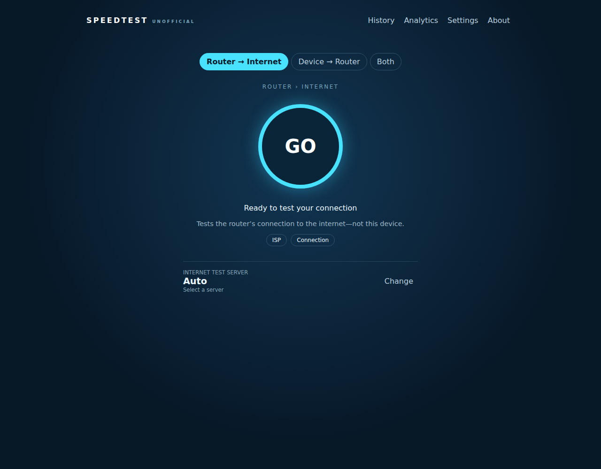

# Unofficial Ookla Speedtest Web for OpenWrt

This is an unofficial community package. Run an Ookla Speedtest from your router and view the result in a native
LuCI or GL.iNet Applications experience. The interface offers separate
**router → internet** and **device → router**
measurements, plus a **Both** action that runs them together and maps the two
paths separately in results, history, and analytics.



## What you get

- A Speedtest-style **GO** dashboard whose live ping, download, and upload
  gauge follows real measurements from the Ookla CLI's JSONL event stream.
- An adaptive gauge scale and needle that track changing speeds without
  pinning faster connections at a fixed maximum.
- Device → Router testing with live rolling gauges for the local Wi-Fi or
  Ethernet path, kept distinct from internet performance.
- A **Both** mode that runs Device → Router first and Router → Internet second,
  then presents separate final result cards for each path.
- A focused final state that returns the compact **GO** control and keeps the
  completed measurements visible in the result cards.
- Manual server selection with search, alongside automatic server selection.
- Persistent test history and simple trend analytics.
- Settings and About views from the upper-right menu.
- A LuCI page under **Services → Ookla Speedtest**.
- A GL.iNet **Applications** entry using the same frontend and service.
- GoodCloud Remote Web Access through the router’s existing authenticated
  LuCI/GL.iNet session. No extra public listener or custom port is added.

## Install

Install the CLI dependency and all web components from the signed OpenWrt feed
with one command:

```sh
wget -qO- https://keithah.github.io/openwrt-packages/install-ookla-speedtest-web.sh | sh
```

The installer configures the signed feed, installs `ookla-speedtest-cli`, and
then installs:

- `ookla-speedtest-webd` — router-side RPC service;
- `luci-app-ookla-speedtest-web` — LuCI integration;
- `gl-app-ookla-speedtest-web` — GL.iNet Applications integration.

The Ookla executable is not stored in this repository or bundled into these
packages. It is provided by the separate CLI package and downloaded according
to that package’s OpenWrt recipe.

## How it works

When you press **GO** for Router → Internet, the web view calls the
authenticated router RPC service. A request-scoped worker launches
`/usr/bin/speedtest` in JSONL mode and reduces its ping, download, upload, and
result events into bounded live state. The view polls that state to drive the
live gauge, adaptive needle scale, and rolling transfer traces; the completed
result is stored in bounded history and shown in the final result card. LuCI
and GL.iNet use the same frontend and service, so the results and behavior are
consistent between both views.

For Device → Router, the browser transfers bounded test payloads through the
same authenticated RPC session and measures application-layer download,
upload, and latency while updating the same gauge with rolling local samples.
It does not open an additional HTTP port. Local and internet records carry
different path labels and remain separate in history and analytics. **Both**
runs the local measurement to completion before starting the router's Ookla
test, then renders both final cards together.

### First launch and Ookla terms

The first attempt to run a test presents Ookla’s Terms of Use and Privacy
Policy agreement. A test cannot start until the agreement is explicitly
accepted. The choice is stored on the router so the prompt does not reappear
on every test; it can be cleared by removing the service state if a new
acceptance is needed.

The server picker passes the selected Ookla server ID to the router-side test.
If no server is selected, Ookla chooses the best available server.

### VPN-aware results

Before returning a result, the service checks the router’s active interfaces
and processes for common VPN paths, including Tailscale, WireGuard, tun/tap,
ZeroTier, and Speedify. The dashboard calls out whether the result reflects a
detected VPN path or the direct WAN path. This makes it clear when an exit
node, tunnel, or traffic-acceleration service is part of the measurement.

## Remote testing with GoodCloud

Enable **Remote Web Access** for the router in GoodCloud, authenticate to the
router, and open the Ookla Speedtest application. The request follows the
existing authenticated remote LuCI/GL.iNet path; this package does not create
an unauthenticated service or require port forwarding.

On a local network, the LuCI route is:

```text
http://router/cgi-bin/luci/admin/services/ookla-speedtest-web
```

## Build from source

Add both repositories to an OpenWrt source tree, select the web packages in
`make menuconfig`, and build:

```sh
git clone https://github.com/keithah/openwrt-ookla-speedtest.git \
  package/openwrt-ookla-speedtest
git clone https://github.com/keithah/openwrt-ookla-speedtest-cli.git \
  package/openwrt-ookla-speedtest-cli
make menuconfig
make package/openwrt-ookla-speedtest/compile V=s
```

The web package depends on `ookla-speedtest-cli`; it does not package the
vendor binary. The resulting package format follows the OpenWrt release:
`.ipk` for older releases and `.apk` for newer releases.

## Updates and licensing

GitHub Actions checks for new upstream releases and updates the package
metadata when a newer compatible version is detected. The repository contains
only package code, frontend assets, tests, and automation. Ookla’s proprietary
binary remains subject to the [Ookla EULA](https://www.speedtest.net/about/eula).

This project is not affiliated with or endorsed by Ookla.
